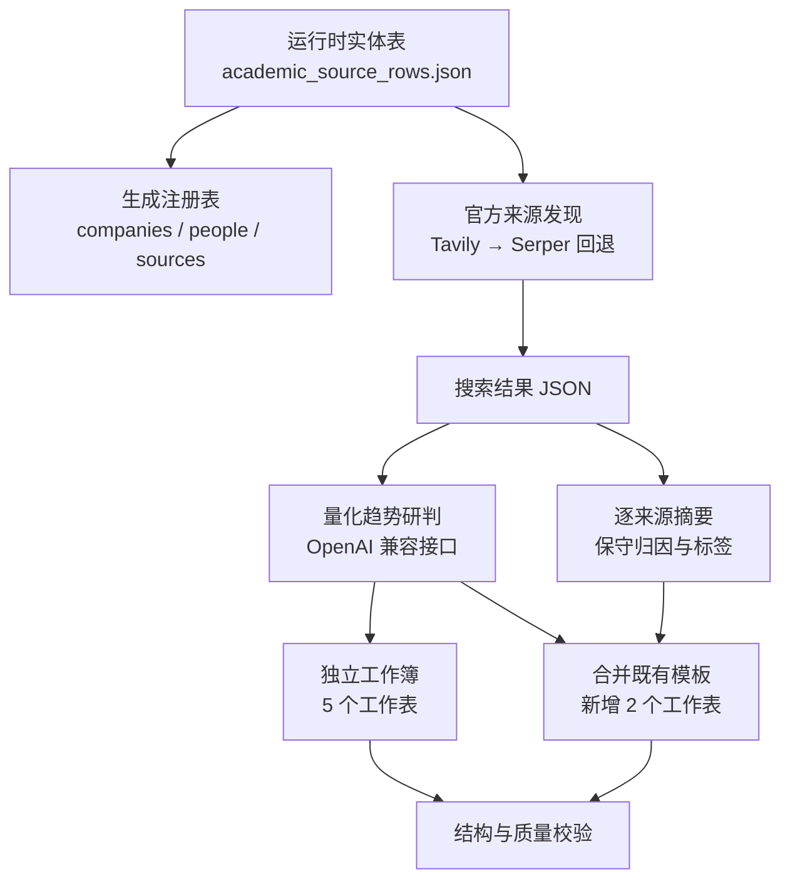

# AI-Tech-Intelligence

面向高校、研究机构与技术研究者的**证据约束型 AI 技术情报流水线**。项目以 `executive-intelligence` Skill 为方法规范，将实体注册、官方来源发现、来源摘要、量化趋势研判、跨实体去重、Excel 导出和交付前校验拆分为可审计的独立阶段。

本项目不追求生成听起来确定的“行业预测”，而是在明确证据边界的前提下回答：

- 哪些机构或研究者正在公开讨论、研究或交付某项 AI 技术？
- 当前判断来自官网、官方代码仓库、个人主页，还是仅来自注册表说明？
- 趋势判断的时间窗口、主观概率、领先指标和证伪条件是什么？
- 哪些结论证据不足、彼此过于相似，或需要人工阅读全文复核？
- 最终交付物能否追溯到来源、分析模型和质量检查结果？

> 当前仓库是一份以 **2026-09-22 / 2026-09-23** 为数据快照日期的实现。部分文件名、日期、查询年份和验收行数写在脚本中；用于新的周期性任务前，请先阅读[已知限制与改造建议](#已知限制与改造建议)。

## 目录

- [Skill 的核心原则](#skill-的核心原则)
- [工作流与系统边界](#工作流与系统边界)
- [当前数据快照](#当前数据快照)
- [项目结构](#项目结构)
- [环境要求](#环境要求)
- [快速开始](#快速开始)
- [配置说明](#配置说明)
- [各阶段详细说明](#各阶段详细说明)
- [数据结构与字段口径](#数据结构与字段口径)
- [Excel 交付物](#excel-交付物)
- [质量门禁](#质量门禁)
- [断点续跑与小规模调试](#断点续跑与小规模调试)
- [扩展实体和来源](#扩展实体和来源)
- [安全与合规](#安全与合规)
- [已知限制与改造建议](#已知限制与改造建议)
- [常见问题](#常见问题)

## Skill 的核心原则

Skill 位于 [`skills/executive-intelligence/SKILL.md`](skills/executive-intelligence/SKILL.md)。它是整条流水线的规则层，本身不会自动执行搜索或生成 Excel；具体执行由 `scripts/` 下的脚本完成。

### 1. 先建立边界，再开始搜索

检索前先加载机构、人物和来源注册表。优先使用机构官网、官方研究页面、官方 GitHub、研究者本人主页以及已登记的官方公开渠道。第三方页面只能作为发现线索，不能直接替代最终证据。

### 2. 将发现、证据、推断和交付分层

项目明确区分来源发现、证据摘录、趋势研判、报告导出和质量校验。搜索结果摘要不等于网页全文，模型推断也不等于机构承诺。

### 3. 保守归因

只有原始材料明确连接“具名人物”和“具体表述”时，才能把内容归因给该人物。机构文章、实验室项目和个人观点不得互相冒充。

### 4. 量化必须可解释、可观察、可证伪

每条趋势判断至少包含截至日期、预测时间窗口、主观概率区间、成熟度阶段、可观察的领先指标、包含数字或日期的阈值、反向信号和明确的证伪条件。

来源中没有数值基线时，不得虚构性能提升百分比。此时可以量化概率、时间窗口、成熟度和观察阈值，但 `expected_change_*` 应保持为空。

### 5. 弱证据必须显式降权

仅有注册表说明、没有近期官方检索材料的实体会被标记为 `Insufficient`：

- `evidence_status = registry_baseline_only`；
- `forecast_status = insufficient_evidence`；
- 主观概率上界不超过 45%；
- 在 Excel 中以醒目底色提示人工补证。

### 6. 结果必须可审计

交付前检查实体数、来源数、URL、概率约束、过期阈值、重复率、Excel 错误值，以及持久化模型名是否为实际分析模型。

## 工作流与系统边界



项目能自动完成官方域过滤、URL 去重、证据评分、结构化模型调用、概率约束、相似度检测和 Excel 校验，但不能保证搜索摘要完整反映原文、搜索引擎没有遗漏、模型理解完全正确，或主观概率具有统计频率意义。高影响结论必须打开官方链接阅读全文，并由人工确认归因、时间和上下文。

## 当前数据快照

| 指标 | 当前值 |
| --- | ---: |
| 注册实体 | 99 |
| 高校 / 研究机构 | 51 |
| 研究者 / 技术公共发声者 | 48 |
| 来源记录 | 304 |
| 有当前官方搜索线索的实体 | 83 |
| 仅有注册表基线的实体 | 16 |
| 已生成量化研判 | 99 |
| 已生成逐来源摘要 | 304 |
| 确定性回退摘要 | 0 |
| 完全重复摘要 | 0 |
| 待相似趋势复核 | 0 |
| 最高两两趋势相似度 | 0.386 |
| 实际持久化分析模型 | `qwen3.7-plus` |

这些数字来自当前 JSON 快照，不是未来运行的固定承诺。更换实体集、检索时间或模型后应重新生成并重新校验。

## 项目结构

```text
AI-Tech-Intelligence/
├─ .env.example                         # 环境变量示例；真实密钥写入 .env.txt
├─ .artifact-runtime/                   # 运行时输入，已被 Git 忽略
│  └─ academic_source_rows.json         # 实体主表：表头 + 99 条实体记录
├─ config/
│  ├─ companies.yaml                    # 实体、官方域名和检索主题
│  ├─ people.yaml                       # 个人研究者注册表
│  └─ sources.yaml                      # 官网、个人主页和官方 GitHub
├─ data/
│  ├─ chatgpt_web_seed_20260922.json    # 已有官方来源种子
│  ├─ academic_web_search_20260922.json # 查询、来源摘录和发现方式
│  ├─ academic_quantitative_outlooks_20260922.json
│  └─ academic_source_summaries_20260923.json
├─ outputs/                             # Excel 与 HTML 预览
├─ scripts/                             # 采集、分析、摘要、导出和校验
├─ skills/executive-intelligence/
│  └─ SKILL.md                           # 方法与质量规则
├─ package.json
└─ README.md
```

`.gitignore` 会忽略 `.env.txt`、`.artifact-runtime/`、`outputs/` 和 `node_modules/`。远程仓库可能包含人工强制纳入版本控制的历史输出，但新的克隆环境不应假定所有运行时输入都存在。特别是 `.artifact-runtime/academic_source_rows.json`，需要由数据持有者另行提供。

## 环境要求

- Windows、macOS 或 Linux；示例命令以 Windows PowerShell 为主；
- Node.js **22 或更高版本**；
- npm；
- 至少一个当前脚本支持的搜索 API：Tavily 或 Serper；
- 一个兼容 OpenAI Chat Completions 的分析模型接口；
- 模板合并模式还需要 `outputs/ai_executive_intelligence_web_20260921.xlsx`。

推荐 Node.js 22+，因为导出脚本使用了 `Object.groupBy`，旧版本可能报 `Object.groupBy is not a function`。

## 快速开始

### 1. 安装依赖

```powershell
npm.cmd ci
```

如果 PowerShell 的执行策略没有拦截 `npm.ps1`，也可以使用 `npm ci`。

### 2. 准备环境变量

```powershell
Copy-Item .env.example .env.txt
```

然后至少填写：

```dotenv
TAVILY_API_KEY=
SERPER_API_KEY=
GENERAL_AI_REPORT_LLM_API_KEY=
GENERAL_AI_REPORT_LLM_BASE_URL=https://api.openai.com/v1
GENERAL_AI_REPORT_LLM_MODEL=
GENERAL_AI_REPORT_LLM_TIMEOUT=240
```

搜索密钥至少配置一个。当前高校采集脚本只读取 Tavily 和 Serper；`.env.example` 中的 Exa、Bocha、Bing、SerpAPI 变量是为其他或后续采集器预留的。

### 3. 准备运行时实体表

创建 `.artifact-runtime/academic_source_rows.json`。文件是二维 JSON 数组，第一行固定为五列表头：机构或姓名、地区或类型、网址或主页、GitHub、说明；从第二行开始每行表示一个实体。

- 类型列包含“个人”时为 `researcher`，否则为 `institution`；
- 包含“国内”时地区为“国内”，否则为“国外”；
- GitHub 可使用破折号或空字符串表示未配置；
- 官网和 GitHub 主机名会成为官方域名白名单；
- 实体 ID 按行号生成，如 `academic_001`。

### 4. 执行主流水线

```powershell
npm.cmd run build:registry
npm.cmd run collect:academic
npm.cmd run analyze:academic
npm.cmd run export:academic
npm.cmd run verify:academic
```

主要输出是搜索 JSON、量化研判 JSON、独立 Excel，以及 `量化趋势判断_预览.html`。工作簿默认位于：

```text
outputs/高校研究机构智能情报_20260922/高校研究机构_AI技术情报量化研判_20260922.xlsx
```

### 5. 可选：生成逐来源摘要并合并既有模板

以下脚本尚未配置 npm 别名，需要直接执行：

```powershell
node scripts/summarize_academic_sources.mjs
node scripts/merge_academic_into_template.mjs
node scripts/render_academic_template_preview.mjs
node scripts/verify_academic_template_merge.mjs
```

模板合并前必须存在 `outputs/ai_executive_intelligence_web_20260921.xlsx`。输出为：

```text
outputs/ai_executive_intelligence_web_20260921_高校研究机构补充_20260923.xlsx
outputs/高校研究机构情报_模板预览.html
```

## 配置说明

### `.env.txt` 中由当前脚本实际读取的变量

| 变量 | 必需 | 使用阶段 | 说明 |
| --- | --- | --- | --- |
| `TAVILY_API_KEY` | 二选一 | 来源采集 | 首选官方域搜索服务 |
| `SERPER_API_KEY` | 二选一 | 来源采集 | Tavily 无有效官方技术结果时回退 |
| `GENERAL_AI_REPORT_LLM_API_KEY` | 是 | 分析、摘要 | OpenAI 兼容接口密钥 |
| `GENERAL_AI_REPORT_LLM_BASE_URL` | 是 | 分析、摘要 | API 根地址或完整的 chat completions 地址 |
| `GENERAL_AI_REPORT_LLM_MODEL` | 否 | 分析、摘要 | 默认 `qwen3.7-plus` |
| `GENERAL_AI_REPORT_LLM_TIMEOUT` | 否 | 分析、摘要 | 超时秒数；趋势默认 240，摘要默认 180 |

环境文件由 `scripts/lib.mjs` 直接读取，不依赖 `dotenv`。它支持空行、井号注释以及带单双引号的值。

### 仅从进程环境读取的变量

以下变量写进 `.env.txt` 不会生效：

| 变量 | 默认值 | 作用 |
| --- | ---: | --- |
| `MAX_ENTITIES` | 全部实体 | 限制本次采集实体数量 |
| `ACADEMIC_RETRY_FALLBACK` | `0` | 设为 `1` 时重试确定性回退摘要 |
| `ACADEMIC_RETRY_BATCH_SIZE` | `10` | 回退摘要重试批大小 |
| `ACADEMIC_RETRY_CONCURRENCY` | `3` | 重试并发，限制在 1–5 |

小规模采集示例：

```powershell
$env:MAX_ENTITIES = '5'
node scripts/collect_academic_intelligence.mjs
Remove-Item Env:MAX_ENTITIES
```

## 各阶段详细说明

### 1. 实体与来源注册

`build_academic_registry.mjs` 从运行时实体表生成：

- `companies.yaml`：实体、地区、类型、别名、官方域名和主题；
- `people.yaml`：个人研究者及其主页；
- `sources.yaml`：官网、个人主页和官方 GitHub。

机构官方研究页默认为 A 级来源，个人主页和官方 GitHub 默认为 B 级。当前采集和分析脚本仍直接读取 `.artifact-runtime` 数据集，不会反向读取 YAML；因此只修改 YAML 不会改变流水线的实体集合。

### 2. 官方来源发现

`collect_academic_intelligence.mjs` 对每个实体执行：

1. 根据名称、官网、GitHub 和技术主题构造查询；
2. 优先调用 Tavily，并限制到登记的官方域；
3. 没有官方技术结果时调用 Serper；
4. 合并 `chatgpt_web_seed_20260922.json` 中的种子；
5. 丢弃非官方域或技术不相关的结果；
6. 清除常见跟踪参数并按 URL 去重；
7. 每个实体最多保留 5 条来源；
8. 没有结果时写入注册表基线，不伪造近期材料。

GitHub 结果必须位于登记的组织或用户路径下；X/Twitter 结果必须位于登记的个人账号路径下。输出保存原查询、标题、URL、搜索摘录、日期、发现方式和错误。脚本每批处理 4 个实体并立即落盘。

### 3. 确定性证据评分

证据分由程序计算，不是模型自评。仅注册表基线固定为 10 分；有搜索来源时按下表累计：

| 组成 | 规则 |
| --- | --- |
| 基础分 | 22 |
| 来源数量 | 每条 +10，最多 +30 |
| 官方 URL | 每条 +7，最多 +20 |
| 近期信号 | 2025 年及以后每条 +7，最多 +18 |
| 技术相关性 | 命中模型、评测、智能体等关键词时 +10 |
| 总分上限 | 90 |

其中“当前年份”在代码中固定为 2026。证据分表示输入材料的支持程度，不表示事实正确率、机构可信度或模型准确率。

### 4. 实体级量化研判

`analyze_academic_outlooks.mjs` 只把实体登记信息、确定性证据分、证据状态，以及最多 5 条官方来源的标题、URL、截断摘录和日期交给模型。

程序会对模型 JSON 做二次约束：

- 概率限制在 0–100，并修正上下界顺序；
- 时间窗口限制在 1–60 个月；
- 成熟度限制为 1–5；
- 证据链接只能来自输入白名单；
- 低证据分使用更保守的概率上限；
- 注册表基线的概率上限最终限制为 45%；
- 阈值统一改写为从 `2026-09-22` 起计算；
- 写入实际配置的模型名和分析方法。

默认每批 10 个实体，每轮并发 3 批。请求失败、JSON 错误或实体缺失时，会生成 `deterministic_fallback` 结果，并明确提示人工复核。

### 5. 跨实体趋势去重

所有 `trend_hypothesis` 会进行 Jaccard 比较：英文按词元切分，中文按二元字符组切分。相似度达到 `0.62` 时标记为 `duplicate_review`，并请求模型围绕实体自己的项目、方法或研究资产改写，再重新计算相似度。

该方法只能识别词面相似，不能替代人工语义去重。

### 6. 逐来源摘要

`summarize_academic_sources.mjs` 为每条链接单独生成：

- 1–3 条核心观点；
- 1–6 个具体技术标签；
- `direct_statement` 归因标记；
- `excerpt_grounded` 或 `baseline_only` 状态；
- 实际模型和分析方法。

摘要模型只能使用标题、搜索摘录和实体说明。注册表基线始终标为 `baseline_only`。模型失败时使用句子截取和关键词规则生成回退摘要。同一实体的两条摘要相似度达到 `0.72` 时，后者会附加来源标题并标记 `dedup_adjusted`。

### 7. 导出与验证

项目既能从零生成独立工作簿，也能在已有高管或厂商情报模板中新增高校研究机构页面。两条路径都有专用验证脚本。生成成功不等于通过验收；只有校验脚本无异常退出，才应视为可交付。

## 数据结构与字段口径

### 搜索结果

`academic_web_search_20260922.json` 按实体保存实际查询式、结果列表和错误列表，顶层还保存生成时间与覆盖指标。每条结果包含：

- `title`：来源标题；
- `url`：规范化后的官方 URL；
- `content`：搜索摘录或注册说明；
- `score`：搜索服务相关度；
- `published_date`：搜索服务提供的日期，可能为空；
- `discovery_method`：Tavily、Serper、种子或注册表基线。

### 量化研判

| 字段 | 含义 |
| --- | --- |
| `trend_hypothesis` | 与实体具体证据绑定的趋势假设 |
| `evidence_chain` | 支持判断的简短证据链 |
| `why_now` | 为什么在当前提出判断 |
| `horizon_months_low/high` | 预测窗口，单位为月 |
| `probability_low/high_pct` | 证据约束的主观概率区间 |
| `maturity_stage_1_5` | 技术成熟度 1–5 |
| `leading_indicator` | 后续应观察的公开信号 |
| `indicator_threshold` | 从截至日期开始计算的阈值 |
| `indicator_threshold_original` | 模型原始阈值，供审计 |
| `counter_signals` | 降低可信度的反向信号 |
| `falsification_criteria` | 推翻或撤销判断的条件 |
| `evidence_level` | 证据等级 |
| `evidence_score_0_100` | 程序化证据分 |
| `evidence_urls` | 输入白名单内的证据链接 |
| `analysis_model/method` | 实际模型与分析方式 |
| `max_similarity` | 最高词面相似度 |
| `duplicate_review` | 是否达到复核阈值 |

证据等级建议解释：

- `Explicit`：摘录存在明确计划或时间性表述，仍需全文确认；
- `Strong inference`：多个具体信号一致，但原文未直接承诺结论；
- `Speculative`：信号较弱或单一，应使用宽概率区间；
- `Insufficient`：只有注册表基线或证据不足。

成熟度 1–5 依次表示早期线索、多项研究或原型、可复现实验或持续项目、稳定平台或广泛使用、成熟基础设施或标准化生态。概率、证据分和成熟度只用于排序与复核，不是统计预测、官方承诺或投资评级。

## Excel 交付物

### 独立工作簿

`export_academic_workbook.mjs` 生成五个工作表：

| 工作表 | 内容 |
| --- | --- |
| `高校研究机构` | 实体名称、地区、类型、主页和研究重点 |
| `来源明细` | 官方搜索摘录或注册表基线及链接 |
| `量化趋势判断` | 趋势、概率、证据、阈值和证伪条件 |
| `覆盖与质量` | 覆盖、证据等级、重复率、模型和发现方式 |
| `说明与口径` | 搜索范围、证据边界、量化方法和限制 |

同时生成只展示前 25 条趋势的 HTML 预览。预览用于视觉检查，不是完整交付物。

### 模板合并工作簿

`merge_academic_into_template.mjs` 保留原工作表，并重建：

- `高校研究机构情报`：每条来源一行、共 20 列；每个实体只在首条来源行写入趋势；
- `高校趋势汇总`：每个实体一行，汇总来源、标签、趋势和置信度。

脚本还会向原工作簿的 `说明与口径` 页追加补充范围、摘要、去重、量化和证据限制说明。

## 质量门禁

独立工作簿校验：

```powershell
node scripts/verify_academic_workbook.mjs
```

当前检查五个工作表是否存在、注册表与趋势表是否各有 99 条数据、来源覆盖是否足够、趋势是否完全重复、阈值是否过期、弱证据概率是否违规、证据链接是否为空，以及是否存在常见 Excel 公式错误。

模板合并校验：

```powershell
node scripts/verify_academic_template_merge.mjs
```

当前检查原始工作表尺寸未改变、新增页面尺寸与 20 列表头契约一致、存在 304 个链接和 99 条趋势、摘要与趋势无完全重复、不残留回退摘要，并且没有公式错误。

这些门禁针对当前 99 实体、304 来源的冻结快照。如果扩展或缩减实体集，必须同步调整验证脚本中的固定行数和数量契约。

## 断点续跑与小规模调试

### 来源采集

采集脚本会读取已有搜索 JSON：已有非基线结果的实体直接复用；只有注册表基线的实体会重新搜索；每批 4 个实体并立即写盘。

如需强制刷新某个实体，应先备份 JSON，再删除 `entities` 中对应项；完整刷新则应先备份并移走整个文件。使用 `MAX_ENTITIES` 小规模运行不会自动删除文件中已有的其他实体。

### 量化研判

分析脚本只处理 `outlooks` 中尚不存在的实体，并在每轮完成后写盘。修改模型、提示词或来源后若要重算，必须先备份并删除对应缓存项。

### 重试回退摘要

```powershell
$env:ACADEMIC_RETRY_FALLBACK = '1'
$env:ACADEMIC_RETRY_BATCH_SIZE = '10'
$env:ACADEMIC_RETRY_CONCURRENCY = '3'
node scripts/summarize_academic_sources.mjs
Remove-Item Env:ACADEMIC_RETRY_FALLBACK
Remove-Item Env:ACADEMIC_RETRY_BATCH_SIZE
Remove-Item Env:ACADEMIC_RETRY_CONCURRENCY
```

该模式只重试 `analysis_method = deterministic_fallback` 的摘要。

## 扩展实体和来源

增加实体时：

1. 备份运行时实体表；
2. 按五列格式添加新行；
3. 确认主页和 GitHub 是实体自己的官方入口；
4. 重新生成注册表并运行完整流水线；
5. 根据新数量更新验证契约。

当前 ID 根据行号生成。在数组中间插入实体会导致后续 ID 整体变化，使旧缓存与新实体错配。长期运行时应把稳定 ID 写入源数据，并修改 `toEntities()` 使用显式 ID。

实际搜索主题位于 `collect_academic_intelligence.mjs` 的查询式和 `techPattern`。只修改 `companies.yaml` 的 `query_topics` 不会改变搜索。扩展机器人、芯片或 AI4Science 等主题时，应同步修改查询构造、相关性规则和官方域白名单。

## 安全与合规

- 不要提交 `.env.txt`、API 密钥或带令牌的 URL；
- 搜索查询会发送给第三方搜索服务，分析输入会发送给所配置的模型服务；
- 不要把未公开、受限或含个人敏感信息的材料发送给外部 API；
- 当前输出面向公开技术情报，不应收集私人联系方式或敏感个人画像；
- 不要把搜索摘录当作可无限转载的正文，应保留链接并控制引用长度；
- 模型名来自配置。使用代理网关时，应确认其实际模型与配置名一致；
- 提交前运行 `git status`，确认密钥、运行时数据和本地输出没有被意外纳入。

## 已知限制与改造建议

### 日期和路径是快照化的

多个脚本把 `2026-09-22`、`2026-09-23`、查询年份和输出路径写在代码中。新一轮运行前应改为统一的截至日期、运行 ID 和路径配置，避免覆盖旧快照或产生过期阈值。

### 主要依据搜索摘录

持久化材料主要是搜索摘要，不是完整网页正文。生产化时建议增加正文抓取与哈希存档，并分别保存发现摘要、正文、证据片段、抓取时间、内容哈希和失败原因。

### 注册表尚未成为唯一事实源

JavaScript 流水线直接从 `.artifact-runtime` 构造实体，YAML 主要用于治理和导出。建议统一为一个稳定、版本化的实体注册表，并让所有脚本只从该注册表读取。

### 校验规则与当前数量耦合

验证脚本硬编码 99 个实体、304 条来源和工作表尺寸。建议将期望数量从输入动态计算，同时保留可选的冻结快照契约。

### 当前年份固定为 2026

`evidenceScore()` 中的当前年份是常量。跨年度运行时应由截至日期派生，否则近期来源评分会逐渐失真。

### 模型回退只保证流程完成

确定性回退能避免整批任务因 API 失败中断，但结果只能作为待复核草稿。模板合并验证要求来源摘要中不存在回退结果，因此正式交付前必须重试或人工修订。

### 相似度不是语义等价检测

Jaccard 方法适合发现明显模板化文本，但可能漏掉语义相同、措辞不同的结论，也可能误报共享术语较多的不同结论。可在保留可解释词面指标的基础上增加嵌入相似度与人工抽查。

## 常见问题

### 提示缺少搜索密钥

确认项目根目录存在 `.env.txt`，并至少填写 Tavily 或 Serper 密钥。只配置 Exa、Bocha、Bing 或 SerpAPI 当前不会生效。

### 提示缺少分析模型密钥或地址

分析和摘要阶段需要 OpenAI 兼容接口。确认 `GENERAL_AI_REPORT_LLM_API_KEY` 与 `GENERAL_AI_REPORT_LLM_BASE_URL` 均已配置。基础地址既可填写 API 根地址，也可直接填写完整的 chat completions 地址。

### 为什么结果仍是旧模型或旧来源

脚本支持断点续跑，会复用已有 JSON。修改模型、提示词或数据后，应先备份并删除对应缓存项，再重新执行。

### 为什么很多记录是 `registry_baseline_only`

常见原因包括官方域名错误、查询年份过窄、页面未被索引、动态渲染、反爬限制，或结果没有命中技术关键词。应先检查该实体的查询式、错误列表和官方域名，而不是直接提高概率。

### 为什么 Excel 校验提示行数不匹配

当前校验器绑定 99 实体和 304 来源的冻结快照。修改实体集或检索结果后，需要同步更新契约，或把固定数量改为从 JSON 动态计算。

### 报错 `Object.groupBy is not a function`

升级到 Node.js 22 或更高版本并重新安装依赖。

### PowerShell 无法运行 npm

使用 `npm.cmd ci` 和 `npm.cmd run <script>`，绕过可能被执行策略拦截的 `npm.ps1`。

### 生成 Excel 后能否直接发布

不能。还应运行对应验证脚本、查看 HTML 预览、打开 Excel 检查布局和链接，并对高影响结论阅读全文复核具名归因、日期和数值口径。

## 推荐交付检查清单

- [ ] 实体主表和官方域名已人工复核；
- [ ] 搜索与分析使用的截至日期一致；
- [ ] API 密钥未进入 Git、JSON、Excel 或日志；
- [ ] `analysis_model` 与实际调用模型一致；
- [ ] 注册表基线项已标记为证据不足；
- [ ] 没有无来源支持的性能提升数字；
- [ ] 具名人物观点已在原文中确认；
- [ ] 高相似趋势已改写或进入人工复核；
- [ ] 对应校验脚本已经通过；
- [ ] Excel 和 HTML 已完成人工视觉检查；
- [ ] 重要结论的官方链接可访问；
- [ ] 报告明确说明概率是主观区间，不是机构承诺。

---

如果要把本项目改造成持续运行的生产级情报系统，优先建议完成三项改造：**统一并版本化实体注册表、把截至日期与路径参数化、增加网页正文证据存档**。这三项会显著提升跨周期可复现性和审计能力。
